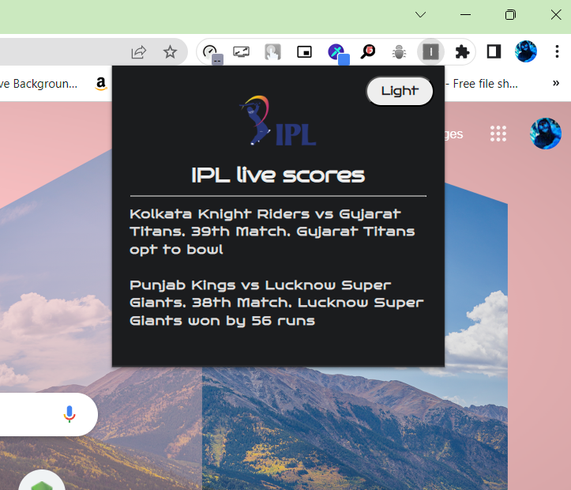
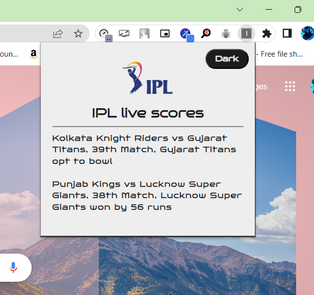

# 🏏 IPL Live Scores Chrome Extension

The IPL Live Scores Chrome Extension is a tool that displays live scores and status updates for IPL cricket matches. It also includes a 🌞 light/dark theme toggle for easy viewing in different lighting environments.

## 📥 Installation

To install the extension, follow these steps:

1. Download the extension from the GitHub repository.
2. Open your Chrome browser and navigate to the Extensions page.
3. Drag and drop the downloaded file into the Extensions page to install.

## 💡 Features

The IPL Live Scores Chrome Extension includes the following features:

- 🏏 Live score updates for IPL cricket matches
- 📈 Status updates for each match, including the current innings, wickets taken, and runs scored
- 🌞 Light/dark theme toggle for easy viewing in different lighting environments

## 📸 Screenshots

Here are some screenshots of the IPL Live Scores Chrome Extension in action:

___

Thank you for using the IPL Live Scores Chrome Extension! 🙏

**⚠️This is not my personal project I just modified the code written by deevankshu garg aka thecodeskool**
